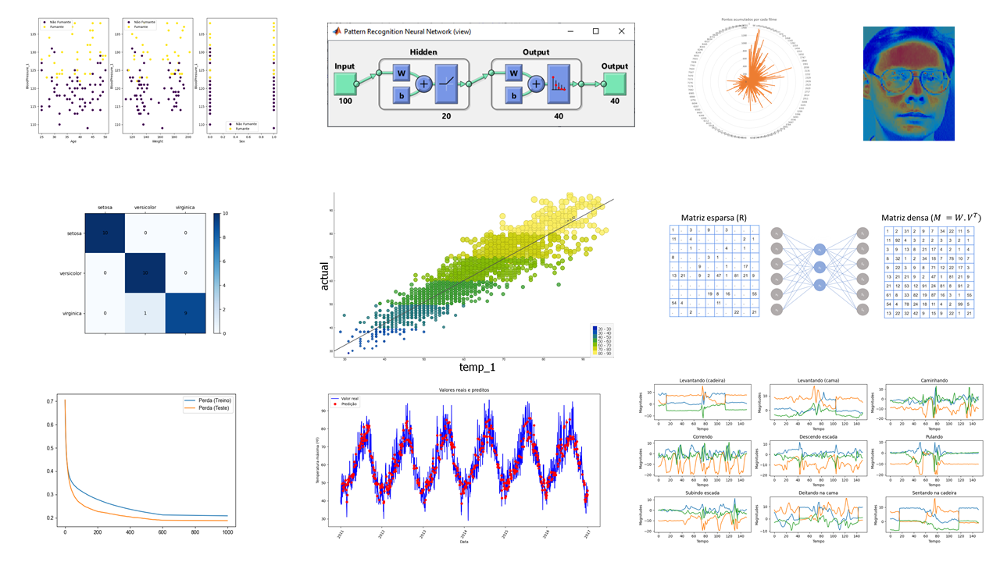

# The AI Library (2022)

# MSC_Machine_Learning
Homeworks, good materials and documents related to the Machine Learning Course

# Folder Machine Learning

Here you can find the following Machine Learning tasks:

- Linear Regression with Multiple Variables
- Naive Bayes classifier
- Logistic Regression
- FeedForward Neural Network
- Random Forest

# Folder Advanced Machine Learning

- Autoencoders for recommendation systems
- Convolutional Neural Network (CNN)
- Recurrent Neural Network (LSTM) for human activity recognition
